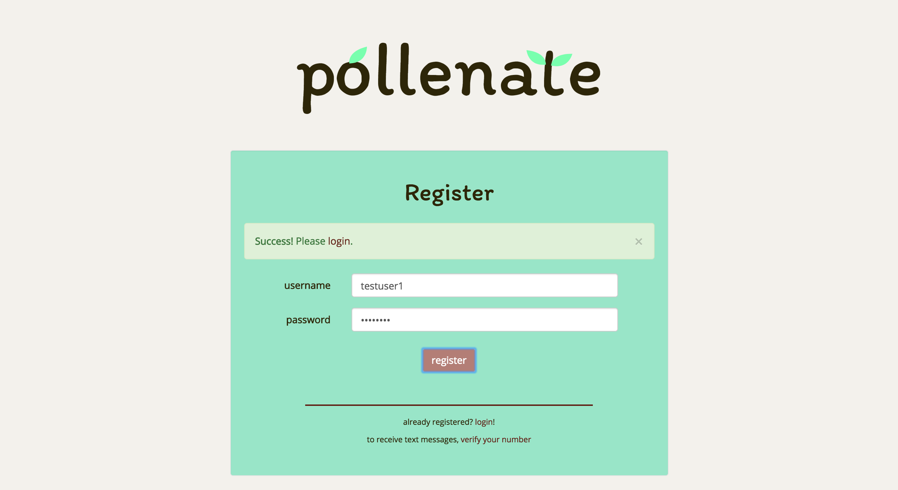
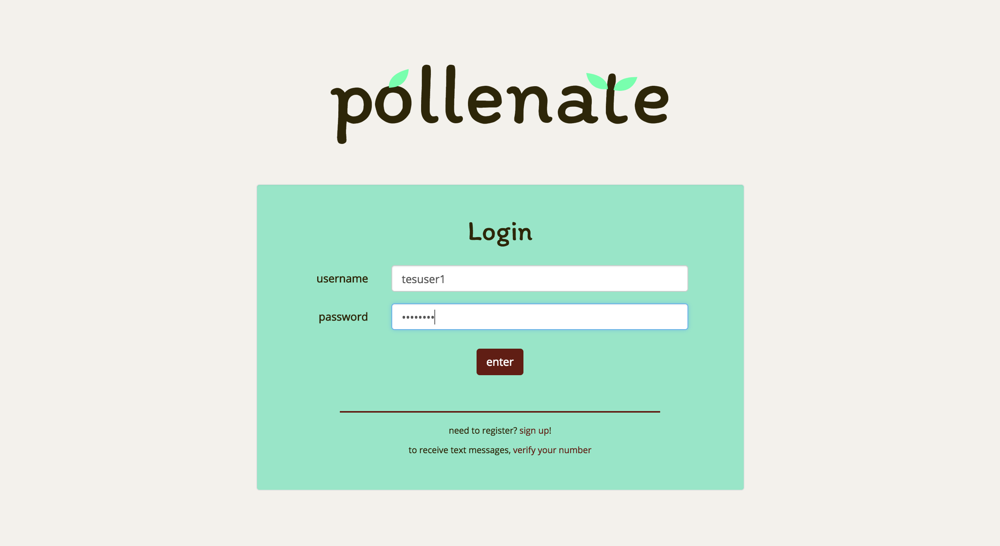

# Pollinate
Pollinate is the culmination of the solo project phase of Prime Digital Academy. The 2-week solo project phase included implementing a scope of work, managing and meeting deadlines, and creating a fully functional web application.

Pollinate will help to cultivate a habit of writing and reflecting on self-affirmations while allowing the User to share affirmations of others as well. The purpose of this application is to serve hopefully as one of many supportive tools for those who may struggle with depression.

## Features
[Register](#register) | [Login/Logout](#login_logout) | [Verify Phone Number](#verify) | [Gather](#gather) | [Grow](#grow) | [Garden](#garden) | [Nutrients](#nutrients)

### <a name="register">Register</a>

Users can register for an account. An alert message will let the user know if they successfully or unsuccessfully registered.

### <a name="login_logout">Login/Logout</a>

Users can login to a registered account. On success, the user will be redirected to the home page.

### <a name="verify">Verify Phone Number</a>

Users can verify their phone numbers in order to receive a text message from this application.

### <a name="gather">Gather</a>

Users can fill out responses or "self-affirmations" called "nutrients" to a single prompt randomly generated from 6 options. These "nutrients" are stored in the database according to each user.

### <a name="grow">Grow</a>

Users will see a stage of the plant according to how much progress they have made on feeding "nutrients" to the plant. The user can feed the plant by clicking "Gather Nutrients." This will randomly generate two prompt responses under a "sun" and "water" image. Users can drag and drop the "sun" and "water" to feed the plant. Once the plant is fully grown the user unlocks a flower that will be stored in their "Garden" page.

### <a name="garden">Garden</a>

Users will see a list of all the flowers they have unlocked. The "Send" button below also contains the number of flowers they have remaining.

Once the user clicks on the image of the flower or the "Send" button a modal will open up guiding the user in the texting the image of the flower along with a affirmation message to the recipient.

### <a name="nutrients">Nutrients</a>

Users can select from a range of dates to reflect and review on the "nutrients" or self-affirmations they entered.

## Usage
<b>Technology Used</b>: SQL, Express, AngularJS, Node.js, Bootstrap, Passport, Twilio REST API, Moment.js, Angular-DragDrop

Fork the repository. Set up a SQL database according to the `database.sql` file. Run `npm install` in the project directory. Then, run `npm start` and go to localhost:3000 in a browser to run the application.

# Authors
- elisa lee
